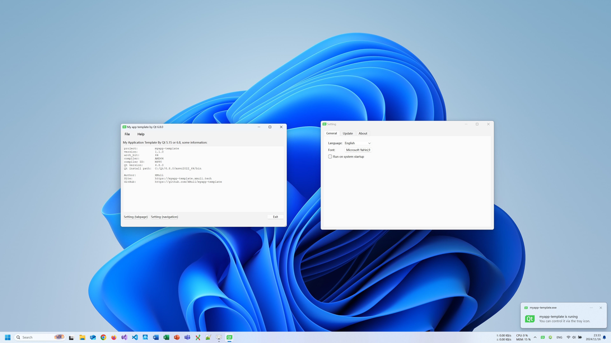
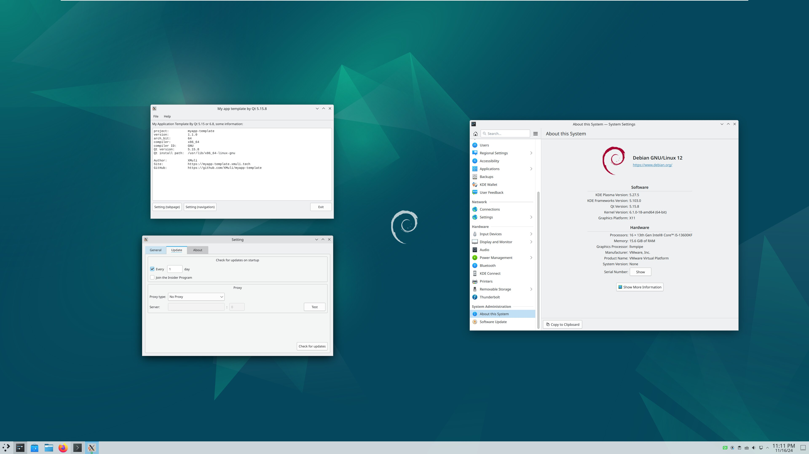
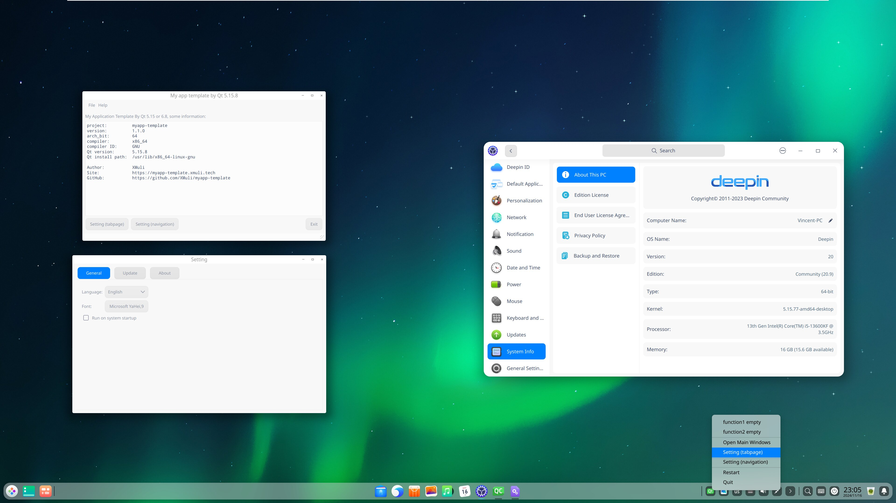

## Introduction

`myapp-template` is a general-purpose minimal desktop application template example, supporting Windows, MacOS, and Linux platforms. It helps in building a complete and universal desktop application by saving the groundwork of setting up basic code. This template supports both Qt versions 5 and 6.

**Features**

- **Settings Window with Tabs**
  - **General**: Multi-language, font and size settings, auto-start on boot
  - **Update**: Software version detection, proxy settings, download updates
  - **About**: Software build and runtime information

- **Main Window**
  - Displays the primary implemented functionality

- **System Tray**
  - System tray in the bottom-right corner and menu options
  - Tooltip notifications

- **Other**
  - Builds and packs for Windows, Linux, and MacOS
  - Script to convert source files to UTF-8-BOM: `convert_to_utf8_bom.py`
  - Multi-language translation script: `create_update_ts2qm.bat`
  - Custom script for creating installation packages without admin privileges: `setup_package.iss`
  - Script to convert `CMakeLists.txt` into Visual Studio 2022 (`.sln`) solution: `build.bat`
  - Git ignore configuration file: `.gitignore`

## Compilation

### **Qt Dependencies:**
The template has been validated with both Qt 5.15 and Qt 6.8. Earlier versions have not been tested.

### **Linux**
```bash
$ sudo apt update
$ sudo apt install git cmake gcc g++ wget tar dh-make lintian devscripts dos2unix

$ sudo apt install qtbase5-dev qtchooser qt5-qmake qtbase5-dev-tools qtcreator qttools5-dev libqt5svg5-dev libqt5x11extras5-dev   # Minimum Qt dependencies
$ sudo apt install debmake libqt5*-dev  # Use this if the above fails

$ find ./ -type f -exec dos2unix {} \;
$ mkdir bin
$ cd bin/
$ cmake ../ -DCMAKE_BUILD_TYPE=Release
$ make -j16
$ cpack -G DEB
```

### **Windows**
Directly open the project in QtCreator and proceed with `CMake-Build-Run`.

### **MacOS**
Refer to the steps for Linux and Windows. Both approaches should work for successful builds.

## Demonstration

### **Windows**
- Supported versions: Windows 7 / 8 / 10 / 11


### **Linux**
- Supported distributions: Debian 12, Deepin 20.9-v23, Ubuntu 22.04-24.04



## Who is Using this Project?

- [Sunny Screenshot](https://github.com/XMuli/SunnyPages/releases): A simple and beautiful screenshot tool supporting Windows, MacOS, and Linux with OCR and image translation capabilities. <sup>[url](https://sunny.xmuli.tech/)</sup>
- [FLIPPED Screenshot](https://github.com/SunnyScreenshot/FLIPPED): An open-source cross-platform screenshot tool. <sup>[url](https://flipped.xmuli.tech/)</sup>

## Coding Tips

### Compile `*.ui` Files into `ui_*.h` Files in CMake

```cmake
list(APPEND CMAKE_AUTOUIC_SEARCH_PATHS "ui/setting")  # Add this line

# Compile individual .ui files into ui_*.h files
execute_process(COMMAND "C:/Qt/5.15.2/msvc2019_64/bin/uic.exe" -o "ui_sub_general.h" "sub_general.ui")
execute_process(COMMAND "C:/Qt/5.15.2/msvc2019_64/bin/uic.exe" -o "ui_sub_update.h" "sub_update.ui")
execute_process(COMMAND "C:/Qt/5.15.2/msvc2019_64/bin/uic.exe" -o "ui_sub_about.h" "sub_about.ui")
```

### Qt Design Guide

To address design issues:

1. Bottom and right-side spacers not expanding properly (set stretch ratio to 10, with height potentially set to 1 and an appropriate expansion policy).
2. In `QTabWidget` subpages, place widgets and spacers directly (avoid embedding an entire composite widget, which may cause improper alignment and centering instead of staying at the top).
3. Ensure that the widget for the update-checking button at the bottom has its spacer height set to 1 (this prevents `general` from having a taller height). For any incorrect heights, setting `Fix` may work better, but following step 1 is the preferred solution.


- **Stretch Ratio of 1 Also Works:** Using 10 for certain compound widgets may result in larger minimum heights, which increases the overall height of the layout.


