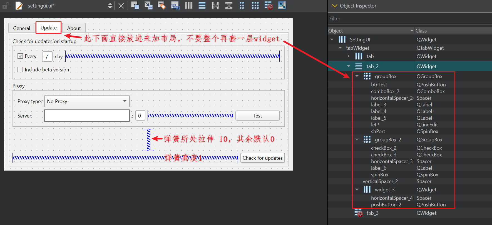
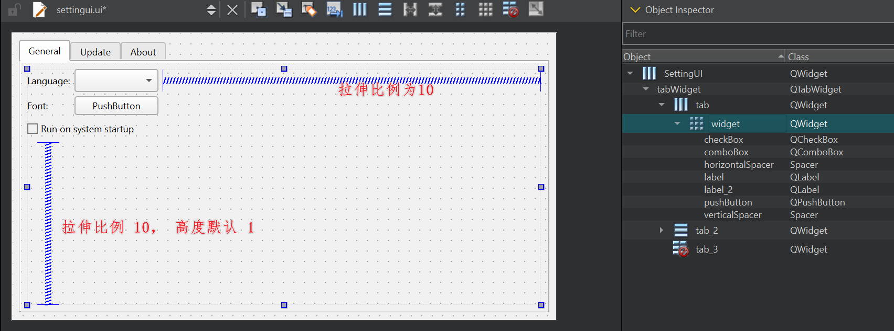

## Qt Design Guide

可解决设计：

1. 底部和右侧弹簧没有扩展的效果（拉伸比例单独设置为10，高度可能为1，扩展策略）
2. QTabWidget 的子page 中，直接放入widget+弹簧后布局（不要直接塞入一整个总的widget， 运行效果上下拉伸，不会置顶而是居中间）
3. 最底部检查更新的widget，弹簧高度设置为 1（避免 general 偏更高）；以及其它高度不对可设置为 Fix(实际 步骤1 效果更佳)

