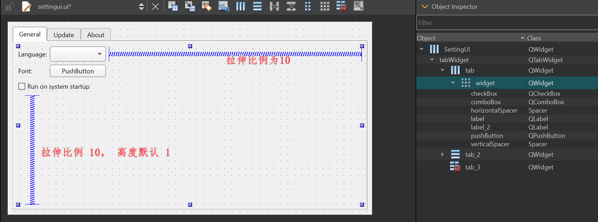
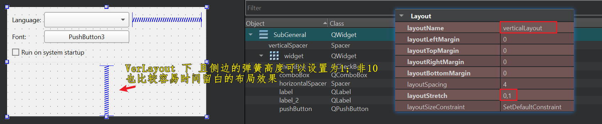

## 介绍

`myapp-template` 是一款通用的最小窗体的桌面应用程序模板示例，支持 Windows，MacOS，Linux 平台；

用以帮助构建一个通用且完整的桌面应用程序，节省开始的基础代码搭建。均支持 Qt 5 和 6 两个大版本。


**功能**

- 一个带有标签页的设置窗口

  - 常规：多语言、字体和字号、开机自启动
  - 更新：检测软件新版本、代理设置、下载新版本
  - 关于：软件构建和运行信息

- 主窗口：

  - 显示主要实现的功能

- 托盘：

  - 系统右下角托盘和菜单选项
  - 悬浮提示

- 其它：

  - windows、Linux、Macos 构建和已经打包封装
  - 批量的源文件转为 utf8-bom 脚本 `convert_to_utf8_bom.py`
  - 多语言翻译脚本：`create_update_ts2qm.bat`
  - 自定义制作安装包脚本,无需任何 admin 权限：`setup_package.iss`
  - CMake (`CMakeLists.txt`) 转 Visual Studio 2022 (`.sln`) 解决方案的脚本：`build.bat`
  - 提交 Git 常见忽略配置文件：`.gitignore`
  
  


## 编译

**QT 依赖：** 已验证使用 Qt5.15 和 Qt6.8 两个版本均构建和运行；更低版本未验证。


**Linux**

```bash
$ sudo apt update
$ sudo apt install git cmake gcc g++ wget tar dh-make lintian devscripts dos2unix         
$ sudo apt install qtbase5-dev qtchooser qt5-qmake qtbase5-dev-tools qtcreator qttools5-dev libqt5svg5-dev   libqt5x11extras5-dev   # qt Minimum required compiled dependencies
$ sudo apt install debmake libqt5*-dev      # If it still fails, using this

$ find ./ -type f -exec dos2unix {} \;
$ mkdir bin
$ cd bin/
$ cmake ../ -DCMAKE_BUILD_TYPE=Release
$ make -j16
$ cpack -G DEB
```


**Windows**

直接使用 QtCreator 打开项目，进行 `CMake-Build-Run`


**MacOS**

参考上面两种方式，都可以成功构建


## 演示

**Windows:**

- Win 7 / 8 / 10 / 11


**Linux:**

- Debian 12
- Deepin20.9-v23
- Ubuntu 22.04-24.04


## 谁在使用本项目？

- [Sunny Screenshot](https://github.com/XMuli/SunnyPages/releases)：Sunny是一款简洁且漂亮的截图软件，支持Windows、MacOS和Linux系统，亦支持 OCR 和图片翻译。 <sup>[url](https://sunny.xmuli.tech/)</sup>
- [FLIPPED Screenshot](https://github.com/SunnyScreenshot/FLIPPED)：开源的跨平台截图软件 <sup>[url](https://flipped.xmuli.tech/)</sup>


## 编码技巧

### \*.ui 单独编译为 ui_\*.h 文件于 CMake

```cmake
list(APPEND CMAKE_AUTOUIC_SEARCH_PATHS "ui/setting")  # 添加此行

# 将单独的 .ui 文件编译为 ui_*.h 文件
execute_process(COMMAND "C:/Qt/5.15.2/msvc2019_64/bin/uic.exe" -o "ui_sub_general.h" "sub_general.ui")
execute_process(COMMAND "C:/Qt/5.15.2/msvc2019_64/bin/uic.exe" -o "ui_sub_update.h" "sub_update.ui")
execute_process(COMMAND "C:/Qt/5.15.2/msvc2019_64/bin/uic.exe" -o "ui_sub_about.h" "sub_about.ui")
```


### Qt Design Guide

可解决设计：

1. 底部和右侧弹簧没有扩展的效果（拉伸比例单独设置为10，高度可能为1，扩展策略）
2. QTabWidget 的子page 中，直接放入widget+弹簧后布局（不要直接塞入一整个总的widget， 运行效果上下拉伸，不会置顶而是居中间）
3. 最底部检查更新的widget，弹簧高度设置为 1（避免 general 偏更高）；以及其它高度不对可设置为 Fix(实际 步骤1 效果更佳)





- **拉升比例为 1 也行**，10 的话若是某些组合控件，则会有一定高度，导致是会有总的最小高度是会增高的，




